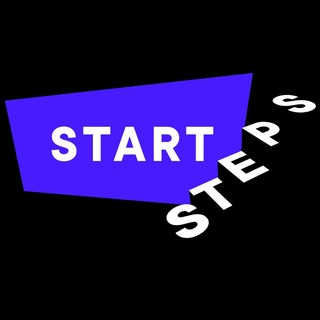
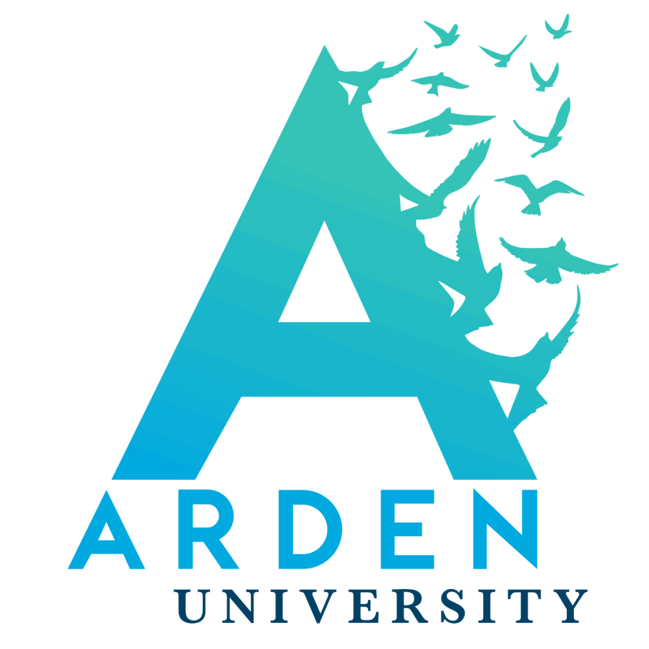

# Freelance education services provided

## Services offered

### Bachelors and Masters course development

I offer comprehensive development services tailored for both undergraduate and graduate-level courses. Our expertise ensures that course materials are meticulously crafted to meet educational standards and fulfill learning objectives effectively.

### 1-on-1 or group trainings

My personalized training sessions cater to individuals or groups seeking proficiency in Python programming. Our curriculum can cover a wide range of topics, including:

- Data visualisation
- Data preparation
- Data modelling

## Current and previous clients

|           |           |
| --------- | --------- |
|  | [Startsteps](https://startsteps.org/en ) is a coding bootcamp based in Berlin with whom I developed a delivered a introductory course to data handling with Python for the Women in Tech group at Zalando.|
| [Career foundry](https://careerfoundry.com/) is an online tech school with whom I helped develop their **Machine Learning with Python** specialization course. |  |
|  | [GISMA University of Applied Sciences](https://www.gisma.com/) provides masters and bachelors courses.I developed multiple of their courses including **advanced programming** and **introduction to Python** |
| [Arden University Berlin](https://arden.ac.uk/berlin) provides a range of masters and bachelors course. With them I delivered lectures on computing topics, and well as developing their **Industry Relevant Tools** training series for Python & Django |  |

## Get started

Please feel free to contact me directly at <williambakermorrison@posteo.net> if you would like to discuss your needs further or schedule a personalized consultation. I'm here to assist you and look forward to the opportunity to connect!