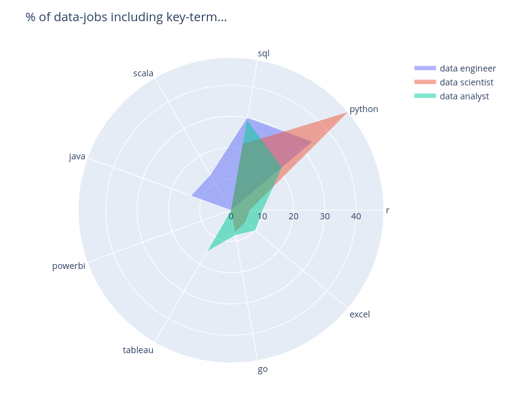

So you want to move into the data field but are unsure where to focus your energy? So many different tools, roles, programming langauges and technologies - where to start? **Well... look no further!**

In this exploratory data analysis (EDA), we'll explore data-related tech roles posted on LinkedIn to investigate which tools, activites and degrees are expected in these roles, and what is most in demand, to help you align yourself in your job-search. Let's get into it!

## Analysis tools

> So what is the difference between the tools you will be using in each job?

Data analyst roles typically use more high-level tools & software (often without any programming!) like Tableau and Excel. Although it can be seen that SQL is often expected across all data job roles. Python is a data scientists bread-and-butter, whilst Java and Scala are exclusively reserved for the Data Engineer.

- **Data-driven decision 1**: Whichever role you decide upon, learning SQL is always going to be helpful! To deal with data you need to deal with databases, and to deal with databases you need SQL :relieved:

**Note**: We excluded other tools and progrmaming languages because they were not referenced in the dataset.

## Daily activities

> How do the everyday activties of the roles differ?

It can be seen that a data analyst spends their time developing dashboards, reports and visualisations towards making analyses and insights. A data engineer is more focused towards developing data pipelines and infrastructure, including ETL and data warehousing. On the other hand, data scientists work to train machine leaning models, test models, conduct feature engineering and derive insights.

- **Data-driven decision 2**: If you're not so comfortable programming, going for a data analyst role might be more suitable. :sparkles:

## University degrees

> Which university degrees are most in demand for these positions?

Data analysts typically come from statistics, finance or economics background (also business but this was excluded from the study). Data scientists tend to get a bit deeper into algorithms, and lower level programming, and therefore there is a need for a mathematics, physics or statistics background. A data engineer builds data software and architectures hence a high demand for a computer science background.

Keep in mind, a job advert is just a guess from the hiring managers towards what their ideal person might look like, so even if you don't come from this academic background, don't be deterred! :muscle:

- **Data-driven decision 3**: Build on the experience you have already, and choose a degree path which matches your individual goals :construction_worker:

## In closing

Hopefully this overview gives you more confidence in your data job journey, of course you have to remain critical of any data analysis (like the one above) and consider your own path, but this shines some light on the topic! 

> Something you'd like to add? If you have any questions or comments, feel free to add your thoughts below! Or message me on LinkedIn!
