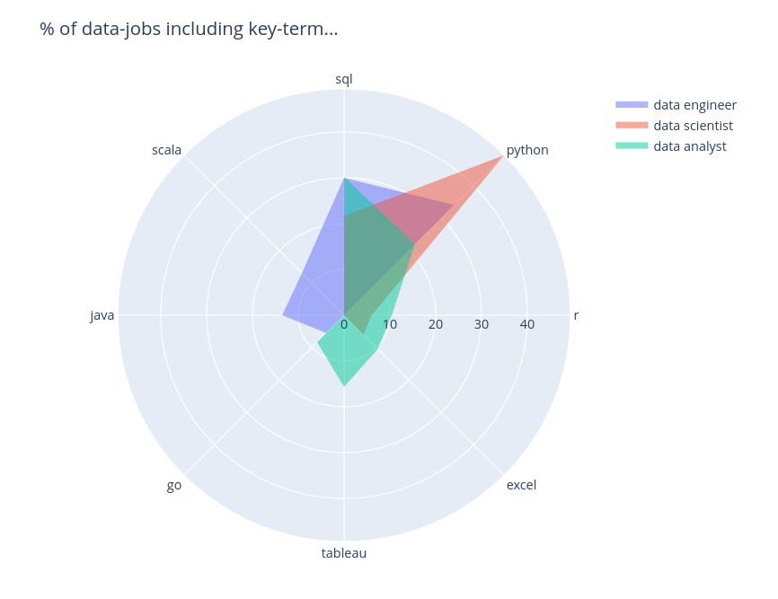
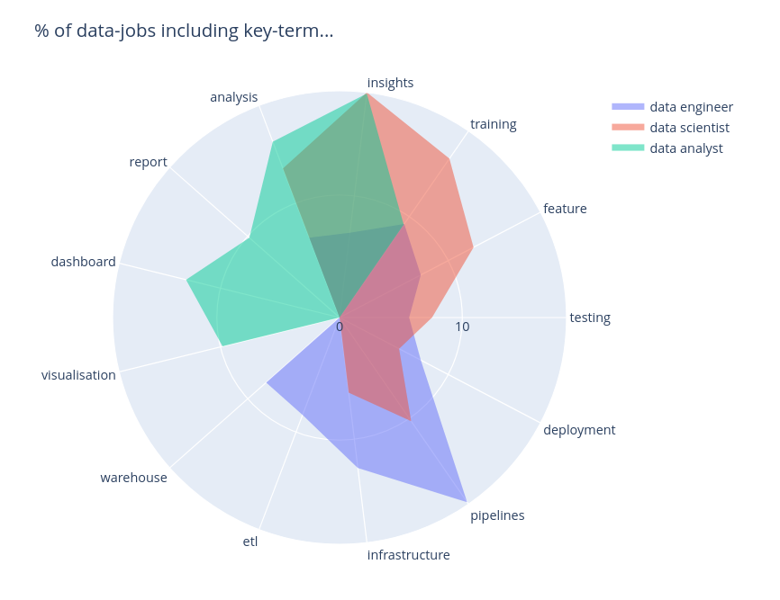
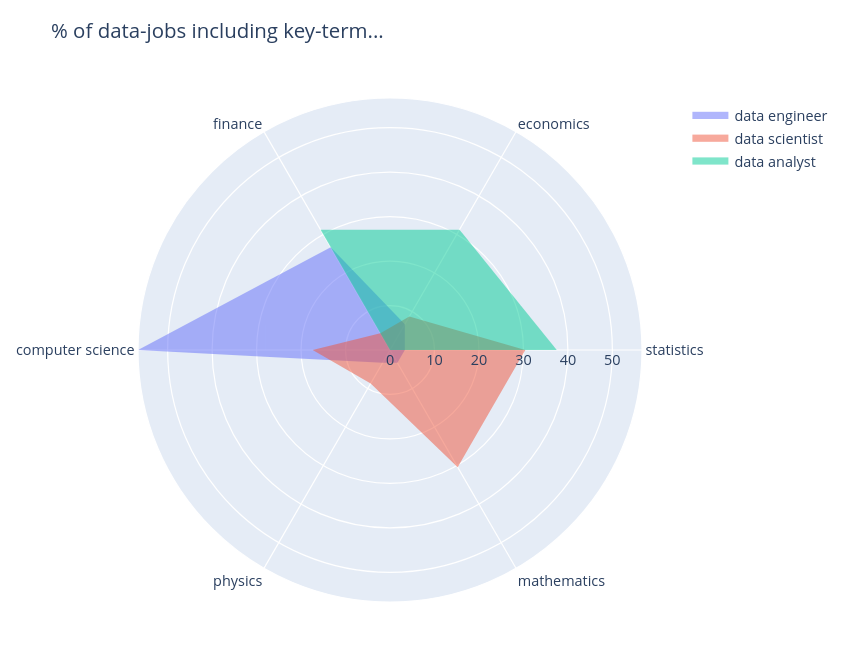

So you want to move into the data field but are unsure where to focus your energy? So many different tools, programming langauges and technologies - where to start? **Well... look no further!**

In this EDA, we explored recent data-tech jobs posted on LinkedIn and investigate which tools, activites and degrees are most in demand. Let's get into it!

## Data tools

> So what is the difference between which tools you will be using in each job?

**Insight:** Data analyst role typically uses more high-level tools (often without any programming!) like Tableau and Excel. Although it can be seen that SQL is expected across all job roles. Python is a data scientists bread-and-butter whilst Java and Scala are exclusively reserved for the Data Engineer.

## Data activities

> How do the different jobs everyday activties differ?

**Insight:** It can be seen that a data analyst spends their time developing dashboards, reports and visualisations - developing analyses and insights. A data engineer is more focused towards developing data pipelines and infrastructure, including ETL and data warehousing. On the other hand, data scientists work to train machine leaning models, test models, conduct feature engineering and derive insights.

## Data degrees

> Which degrees are most in demand for these positions?

**Insight:** Data analysts typically come from statistics, finance or economics background (also business but this was excluded from the study). Data scientists tend to get a bit deeper into algorithms and therefore there is a need for mathematics/physics/statistics. A data engineer builds data software and architectures hence a high demand for a computer science background.

## In closing

Finally, of course you have to remain critical and consider your own path, but hopefully this overview gives you more confidence in your data job journey.

> Something you'd like to add? If you have any questions or comments, feel free to add your thoughts below! Or message me on LinkedIn!
