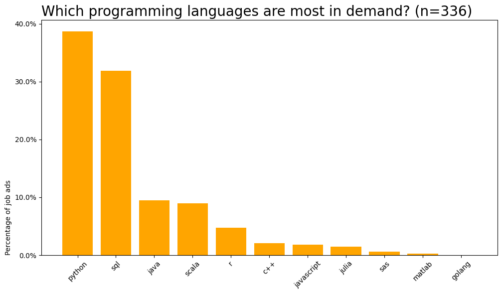
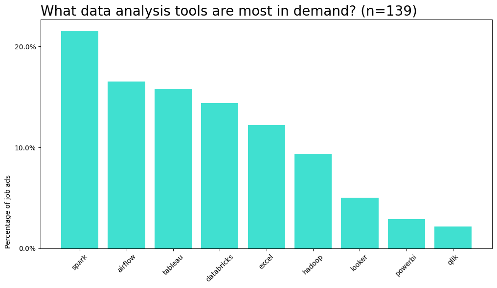
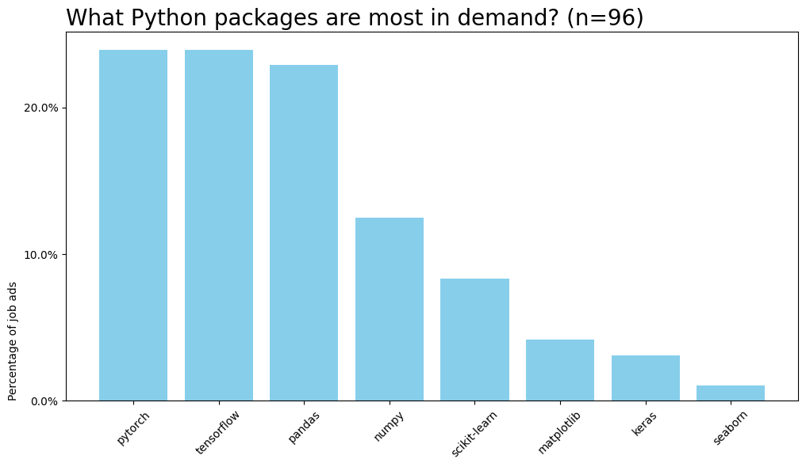

So you want to move into the data field but are unsure where to focus your energy? So many different tools, roles, programming langauges and technologies - where to start? **Well... look no further!**

> _**TLDR**: If you want to be competing for Berlin data jobs in 2024, learn Python, SQL and AWS  (also consider one Apache tool, like Spark or Airflow)_

In this blogpost, I will explore some of the results from a descriptive analytics mini-project of +400 job ads from the Berlin tech market in March 2024.

## Programming languages

Firstly let's investigate the most popular programming langauges in data jobs in Berlin.

It's pretty clear that **Python and SQL** are the most in demand skills, with over a third of all data jobs asking for these skills respectively. The gender-diverse Kings and Queens of data analysis reign supreme! Now this may not be a huge surprise, but what is also interesting to note is the runners up:

- **Java** is commonly used for processing and analyzing large amounts of data efficiently.
- **Scala**  excels at handling big data problems, favored by Apache Spark and compatible with Java..
- **R** focuses on statistical analysis, with a large collection of packages for data analysis, visualization, and machine learning.
- **C++** is a powerful programming language known for its efficiency, making it ideal for tasks requiring intense processing, like high-frequency trading or complex simulations.

> **Open-source alert!**: Notice how the only two "closed-source" languages are Matlab and SAS (and those you need to pay to use).

Let's move onto data analysis tools...

## Analysis tools

Analysis tools are softwares which make engineers and analysts lives easier as part of their everyday workflow, including things like data visualisation, big data handling, scheduling and more...

Here most people will know **Tableau and Excel** but what about the other tools?

- **Spark** is an Apache tool that can handle and analyze large amounts of data quickly..
- **Airflow** is another Apache tool for setting up and keeping an eye on a series of tasks, such as data processing or machine learning steps
- **Databricks** is a platform for storing data and building AI applications (also made by the developers of Apache Spark). 

What's the deal with all this "**Apache**" software? Well, it's part of the [Apache Software Foundation](https://apache.org/) (ASF) a non-profit organization that supports and promotes open-source software projects.

> **Open-source alert again!**: With all this free and open-source software (FOSS) around, it's almost surprising that Tableau is still kicking around in the most demanded tools, even though it is propreitary and closed-source, costing around €500-€1000 per year. Do you think there will be a FOSS equivalent within the next 5 years?

Next... let's check out the Python packages most in demand in 2024.

## Python packages

What do all these Python packages do? Well Pytorch, Tensorflow and Keras are all deep learning and AI packages for complex machine learning problems. Pandas is your everyday data handling tool, scikitlearn your basic ML tool and matplotlib is used for visualisations. Basically, a comprehensive toolkit for building data analytics and machine learning tools!

## Cloud technologies

Last but not least, (_turns on smoke machine_) ... THE CLOUD ... (_turns off smoke machine_). Basically, "the cloud" is a shed somewhere with hundreds of computers which you pay someone to process or store your terrabytes of data instead of doing it on your struggling laptop. These days it's a common expectation for data scientists and engineers to be experienced with cloud technologies for storage and/or processing purposes.

Looking at the data tech jobs, a whopping 40% of job ads mentioned "cloud" with the most popular cloud service provider being AWS (Amazon Web Services), followed by Azure, the Microsoft equivalent.

## In closing

Finally, of course you have to remain critical and consider your own path, but hopefully this overview gives you more confidence in your data job journey.

> Something you'd like to add? If you have any questions or comments, feel free to add your thoughts below!

Checkout the full analysis [here](https://www.kaggle.com/code/wilomentena/summary-statistics-of-data-job-market-berlin)