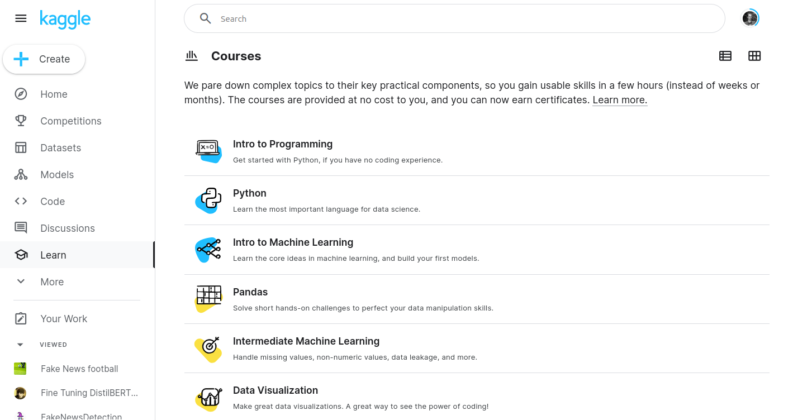
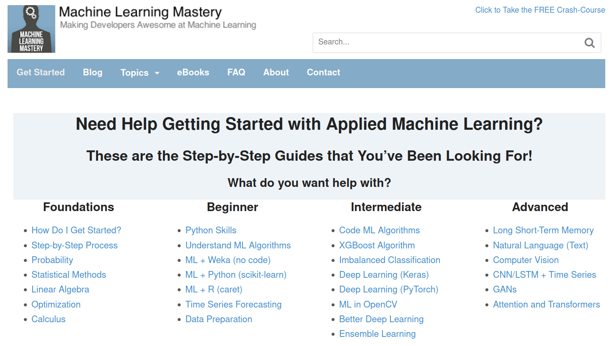
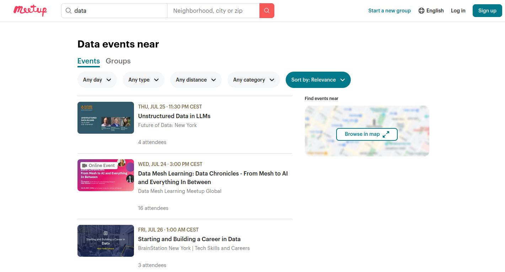

For data analysts and scientists (and other tech-job seekers), there are numerous online resources, communities, and platforms that can help with learning, networking, and staying updated with the latest trends and technologies.

But there are so many(!) and it might be overwhelming, so here are some key resources that I’d personally recommend to get you started:

## Online Communities

1. **Kaggle Learn & Competitions** - The best place to start is probably with one of [Kaggle Learn tutorials](https://www.kaggle.com/learn), sign up with your email and then they will guide you through a practice competition. Otherwise, search for interesting [datasets](https://www.kaggle.com/datasets) and publish your own notebooks, which you can then discuss with others, ask questions and learn from the community. For example try their [Intro to Machine Learning](https://www.kaggle.com/learn/intro-to-machine-learning) mini-course.

2. **Stack Overflow** - The world’s biggest community of software developers, a go-to for asking programming questions and finding solutions. You can also learn by helping others out, and making the community better by becoming a moderator. How to start? Have a look through the [FAQs](https://meta.stackoverflow.com/questions/251225/faq-index-for-stack-overflow) with some beginner guides and tips on asking questions. You might also want to checkout [_Cross Validated_ ](https://stats.stackexchange.com/)  their sister website focusing on more techincal questions related to statistics, machine learning and data analysis.

## Learning Platforms

1. **Coursera** - Offers courses and specializations in data science and machine learning from top universities and companies (specifically [ML specialisation by Andrew Ng](https://www.coursera.org/specializations/machine-learning-introduction))

2. **edX** - Provides data science courses from institutions like MIT, Harvard, and Microsoft. (like this [Introduction to Data science](https://www.edx.org/learn/data-science/harvard-university-introduction-to-data-science-with-python?index=product&queryID=6da067b3a66ffcc3a1f1ecba20ba3c93&position=1&results_level=first-level-results&term=data+science&objectID=course-c2004e8e-3882-4927-a883-1c5f39a28865&campaign=Introduction+to+Data+Science+with+Python&source=edX&product_category=course&placement_url=https%3A%2F%2Fwww.edx.org%2Fsearch))

## Blogs and Websites

1. **W3Schools** - One of the most accessible and easy-to-follow tutorial blogs on Python, [Data Science](https://www.w3schools.com/datascience/default.asp), PostgreSQL and more! It won't go into great depth, but provides you with all the fundamentals you'll need to get started on a topic.

2. **Analytics Vidhya** - Provides articles, hackathons, and a community forum for data science professionals. Check-out their guides, for a nice holitic overview of a topic, like this one on [linear regression](https://www.analyticsvidhya.com/blog/2021/10/everything-you-need-to-know-about-linear-regression/) going from all the theory aspects to Python implementations.

3. **Machine Learning Mastery** - Provides very high quality learning content, like this guide on [Docker for beginners](https://machinelearningmastery.com/the-ultimate-beginners-guide-to-docker/) often going in a little deeper than some other sites, but still accessible.

4. **DataCamp** - contains many useful walkthroughs and articles on their [blog](https://www.datacamp.com/tutorial/category/ai) and they even offer a [Data Science certification](https://www.datacamp.com/certification/data-scientist?irgwc=1&utm_medium=affiliate&utm_source=impact&utm_campaign=000000_1-2302977_2-mix_3-all_4-na_5-na_6-na_7-mp_8-affl-ip_9-na_10-bau_11-Guiding%20Tech%20Media&utm_content=ONLINE_TRACKING_LINK&utm_term=) which would be a nice addition for your CV!

## Networking and Events

1. **Meetup** - Although not quite was it used to be, on Meetup you can find local and online tech meetups and events, like this [Python meetup](https://www.meetup.com/de-DE/dcpython/events/300478216/?recId=266f8762-9538-427f-a3b8-cd3987d7f705&recSource=keyword_search&searchId=e687dc52-adae-4e38-88c5-fac622b0ce08) great for learning and networking!

2. **Tech conferences and festivals** - Big cities often host interesting conferences and festivals, some free, some paid. For example, checkout the [Green-tech festival](https://greentechfestival.com/) coming to Berlin in 2025, or the [Open Science Conference](https://www.open-science-conference.eu/). More often than not, you'll be at least be able to attend online for free!

## News and Updates

1. **Newsletters** -Stay up to date with news and trends by following a weekly like this one by [Open Data Science](https://opendatascience.com/newsletter/) or [Data Talks Club](https://datatalks.club/)

2. **MIT Technology Review** - The [MIT Technology review](https://www.technologyreview.com/ ) site gives a nice curated overview of technology news often with a critical perspective.

These resources can help you stay informed, enhance your skills, and connect with other professionals in the field of data science and analytics.

**Any more resources you'd like to add to the list? Add your comments below**