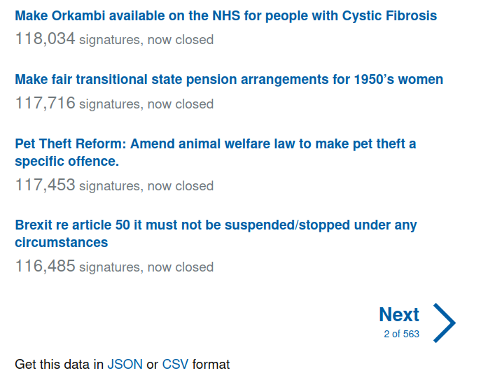
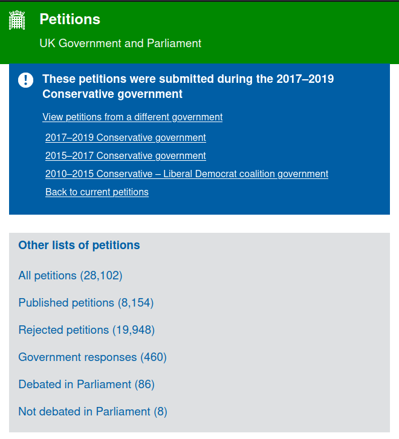
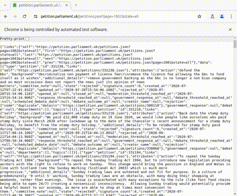

We often see government petitions on our social media platforms. “Sign this petition to make Fridays a national pajama day”, “Declare ice-cream an essential service”, and so on, but what actually happens to these petitions? And which ones lead to concrete change?

Well I wanted to find out, and thankfully under an [Open Government License](https://www.nationalarchives.gov.uk/doc/open-government-licence/version/3/) the UK government publishes records of all petitions submitted and processed by the [Petitions Committee](https://committees.parliament.uk/committee/326/petitions-committee/). So I went to the [UK government petition website](https://petition.parliament.uk/petitions) to access the freely available data. However, as I came to find out, the tricky part is that “open-data” often translates to “data behind multiple little hurdles”.

> _“open-data” often translates to “data behind multiple little hurdles”_

And before we even dive into it, let’s take a step back and remind ourselves that the purpose of such initiatives is to enable participatory democracy. To give citizens an additional voice beyond voting and help address the concerns they might have. In this regard shouldn’t the government develop and publish their own data analysis on this dataset? If the objective of this committee was truly nobel, wouldn’t you expect they do their upmost to utilize and communicate the insights and findings from their own data? **_foreshadow_**

## The problem

So when we start looking at the petitions data portal, we come to the website directory of “all petitions” contains hundreds of pages each with individual CSV or JSON files (a standard type of data file format). No-one has the time to click through all these, download and process them individually. **How can we tame them?**

Well firstly better standards. And rather unfortunately for post-Brexit UK, from April 2024, the [Interoperable Europe Act](https://data.europa.eu/en/news-events/news/embracing-open-standards-open-data-ecosystem-interoperability-across-europe) will help towards this in all European member state governmental data portals - encouraging better standardisation and ensuring interoperability.

Certainly, the current design of the UK petition data portal may have saved the developers time when building it (e.g. alleviate potential server load issues), however, the inability to allow full-batch downloads remains cumbersome and, I would argue, poses a significant obstacle to open-data portals and government transparency initiatives more generally.

On top of this, petitions submitted under other Governments are tucked away in an “archived” section at the bottom of the page, again with multiple sub-links and no batch downloads possible. 

And while some of the smaller UK political parties acknowledge the failures of Brexit, talk of the UK returning to the EU single market, and re-adopting EU law, until then, we must either pray for a progressive & tech-minded UK government or get hacking! So I built a web-scraper and curated an open-access dataset so that all could use it.

## The solution

Luckily, that’s where the power of web-scraping comes in 💪 We can write scripts to automate this task. By creating a bot in Python (and the Selenium library), we can (automatically) turn through each page, download the individual data files and then combine them into a single complete dataset.

And so this is what we did! Above you can see the scraper rushing through all the pages, and downloading the files faster than we ever could. The only problem with these tools is that we must build custom scripts for every website, as each site is slightly different. But nevertheless, now we have this one, we can run it whenever we need to update our database.

After each of the files were download, some cleaning and tidying was necessary, afterwhich we could combine all the petition data into **ONE SINGLE SOURCE**!

And you can access the [full dataset here](https://www.kaggle.com/datasets/wilomentena/uk-government-petitions?select=petitions_all.csv)

So now we’ve got the data, I can finally begin with the analysis (to be continued...)

## Upcoming analysis

The overall research questions will include:

- Of those petitions debated in parliament, how many led to new government initiatives?
- Which petition topics are most requested?
- What are the main reasons petitions to get rejected?
- How many voices (i.e. petition signatures) were listened to and how many went unheard?
- How has the number of petitions and signatures changed over time

Tune in for Part 2, where I'll be diving into some insights uncovered from this dataset.

**Want to contribute to this project? Feel free to start your own codespace on Kaggle or message me to join a working group.**

> Something you'd like to add? If you have any questions or comments, feel free to add your thoughts below!

