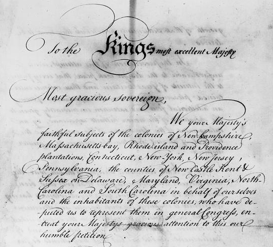

We often see petitions on our social media platforms demanding our governments do all sorts of things like “make Fridays a national pajama day” or “Declare ice-cream an essential service”. But do they really change anything?

Let's first look into how petitioning came about in the first place...

## A brief history of petitioning

This bottom-up approach to direct democracy has a rich and fascinating history. In fact, the right to petition was written into the Magna Carta back in 1215, a foundational document in the history of European democracy, which established that the UK Parliament should:

> _"hear by petition delivered to them, the Complaints of all those that will complain them of such Delays or Grievances done to them"_

So, listen to the people! Well, actually, at the time it was more like listen to the church, rich landowners, and nobility. However, this precedent of petitioning paved the way for its inclusion in the 1689 UK Bill of Rights, which set out other basic civil rights such as free elections and freedom of speech for all subjects.

Petitioning was also widespread in [18th Century North America](https://openyls.law.yale.edu/bitstream/handle/20.500.13051/16443/14_96YaleLJ142_November1986_.pdf?sequence=2&isAllowed=y), inspired by the UK Bill of Rights. Emerging colonial assemblies, keen to resolve local disputes, encouraged petitions as a means to validate their control and keep the colonisers from infighting. This was a time before the internet, and ruling powers needed the information to govern effectively. In this sense, petitioning was historically seen an instrument of the elite and the state rather than a tool for the people.

In 1775, tensions between the North American colonies and Great Britian peaked, when the [Olive Branch Petition](https://en.wikipedia.org/wiki/Olive_Branch_Petition) which was not even read by King George III, led to the American Revolutionary War and the eventual Declaration of Independence. So, indirectly, without petitions there would be no USA!

After the war, petitioning continued to be an important beaurocratic tool, and it was enshrined in the United States Bill of Rights in 1791. In some cases -- women, criminals, indigenous peoples, and even slaves -- voiced their grievances through petitions. However, as a backlog of petitions grew, a sense of unequal hearing developed and the influence of petitions was put to question, particularly during the rise of the abolition movement, which eventually resulted in a controversial ban on anti-slavery petitions by the House of Representatives:

> _No petitions of resolutions "praying the abolition of slavery... shall be received by this House, or entertained in anyway whatever"_

Despite such barriers, abolitionist petitions provided a platform to articulate their anti-slavery arguments and mobilize public sentiment. Over time, the accumulation of their petitions contributed to legislative debates and ultimately culminated in the abolition of slavery in 1865.

Today, the right to petition remains a continued aspect of democratic societies around the world. In the digital age, online petitions have amplified this practice, allowing for wider participation and awareness. The historical evolution of petitioning highlights its enduring importance as a tool for advocacy and change, reminding us of the possibilities that collective voices can have to shape society and influence governance.

## Introduction

Back to now, what happens to these petitions the UK parliament? And which ones actually lead to concrete change?

Well I wanted to find out, and thankfully under an [Open Government License](https://www.nationalarchives.gov.uk/doc/open-government-licence/version/3/) the UK government publishes records of all petitions submitted and processed by the [Petitions Committee](https://committees.parliament.uk/committee/326/petitions-committee/). So I went to the [UK government petition website](https://petition.parliament.uk/petitions) to access the freely available data. However, as I came to find out, the tricky part is that “open-data” often translates to “data behind multiple little hurdles”. 

> _“open-data” often translates to “data behind multiple little hurdles”_

Furthermore, there was no analysis provided; which I found curious. Which led me to ask: if the objective of this committee was truly noble, wouldn’t you expect they do their utmost to utilize and communicate the insights and findings from their own data? With millions of signatures submitted over the past decade, at the very least, this dataset is an invaluable barometer for public opinion.

## The problem

The website directory of [“all petitions”](https://petition.parliament.uk/archived/petitions?parliament=3&parliament=3&state=all) contains hundreds of pages each with individual CSV or JSON files (a standard type of data file format). No-one has the time to click through all these, download and process them individually. **How can we tame them?**

Well firstly better standards. And rather unfortunately for post-Brexit UK, from April 2024, the [Interoperable Europe Act](https://data.europa.eu/en/news-events/news/embracing-open-standards-open-data-ecosystem-interoperability-across-europe) will help towards this in all European member state governmental data portals - encouraging better standardisation and ensuring interoperability, a process which the UK will be left out of.

Certainly, the current design of the UK petition data portal may have saved the developers time when building it (e.g. alleviate potential server load issues), however, the inability to allow full-batch downloads remains cumbersome and, I would argue, poses a significant obstacle to open-data portals and government transparency initiatives more generally - by creating huge friction in the access and acquisition of the data.

On top of this, petitions submitted under other Governments are tucked away in an “archived” section at the bottom of the page, again with multiple sub-links and no batch downloads possible.

While some of the smaller UK political parties acknowledge the failures of Brexit, talk of the UK returning to the EU single market, and re-adopting EU law, until then, we must either pray for a progressive & tech-minded UK government or get hacking! So I built a web-scraper and curated an open-access dataset so that all could use it.

## The solution

Luckily, that’s where the power of web-scraping comes in 💪 We can write scripts to automate this task. By creating a bot in Python (and the [Selenium library](https://selenium-python.readthedocs.io/)), we can (automatically) turn through each page, download the individual data files and then combine them into a single complete dataset.

Above you can see the scraper in action, running through all the pages, and downloading the files faster than we ever could. The only problem with these tools is that we must build custom scripts for every website, as each website is slightly different.

After each of the files were downloaded, some cleaning and tidying was necessary, afterwhich we could combine all the petition data into **ONE SINGLE SOURCE**!

And you can access the [full dataset here](https://www.kaggle.com/datasets/wilomentena/uk-government-petitions?select=petitions_all.csv)

So now we’ve got the data, I can finally begin with the analysis (to be continued...)

## Upcoming analysis

The overall research questions will include:

- Of those petitions debated in parliament, how many led to new government initiatives?
- Which petition topics are most requested?
- What are the main reasons petitions to get rejected?
- How many voices (i.e. petition signatures) were listened to and how many went unheard?
- How has the number of petitions and signatures changed over time

Tune in for Part 2, where I'll be diving into some insights uncovered from this dataset.

**Want to contribute to this project? Feel free to start your own codespace on Kaggle or message me to join a working group.**

> Something you'd like to add? If you have any questions or comments, feel free to add your thoughts below!
